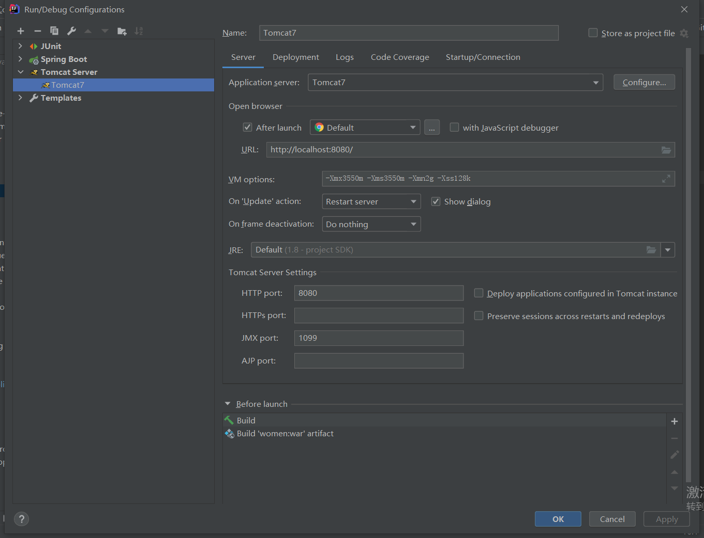
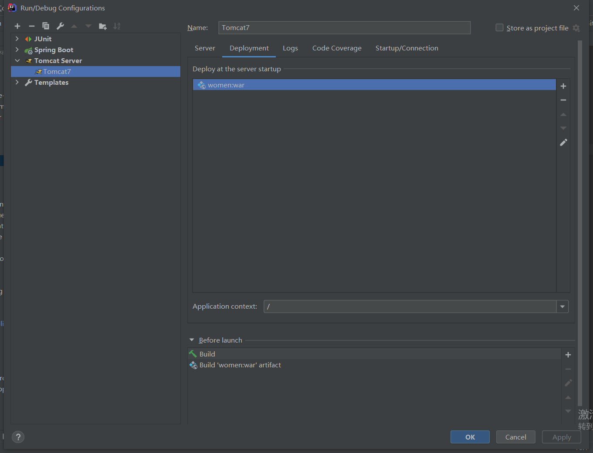

# IDEA + SpringBoot + JSP + Tomcat 配置

**1. 使用外部 Tomcat 而不是 Spring Boot 内嵌的 Tomcat 时，添加**

```xml
<!-- 添加 Servlet -->
<dependency>
	<groupId>javax.servlet</groupId>
	<artifactId>javax.servlet-api</artifactId>
	<scope>provided</scope>
</dependency>
		
<!-- 移除内嵌的 Tomcat -->		
<dependency>
	<groupId>org.springframework.boot</groupId>
    <artifactId>spring-boot-starter-web</artifactId>
    <exclusions>
		<!--移除tomcat插件，将项目部署到本地tomcat-->
        <exclusion>
			<groupId>org.springframework.boot</groupId>
			<artifactId>spring-boot-starter-tomcat</artifactId>
		</exclusion>
	</exclusions>
</dependency>

<!-- 移除使用内嵌 Tomcat 的 JSP 标签 -->
<!--        <dependency>-->
<!--            <groupId>org.apache.tomcat.embed</groupId>-->
<!--            <artifactId>tomcat-embed-jasper</artifactId>-->
<!--        </dependency>-->
```

**2. 添加启动类**

```java
@SpringBootApplication
public class AllApplication extends SpringBootServletInitializer {

    public static void main(String[] args) {
        SpringApplication.run(AllApplication.class, args);
    }

    @Override
    protected SpringApplicationBuilder configure(SpringApplicationBuilder builder) {
        // 注意这里要指向原先用main方法执行的Application启动类
        return builder.sources(AllApplication.class);
    }

}
```

**3. 添加 Tomcat**


	

